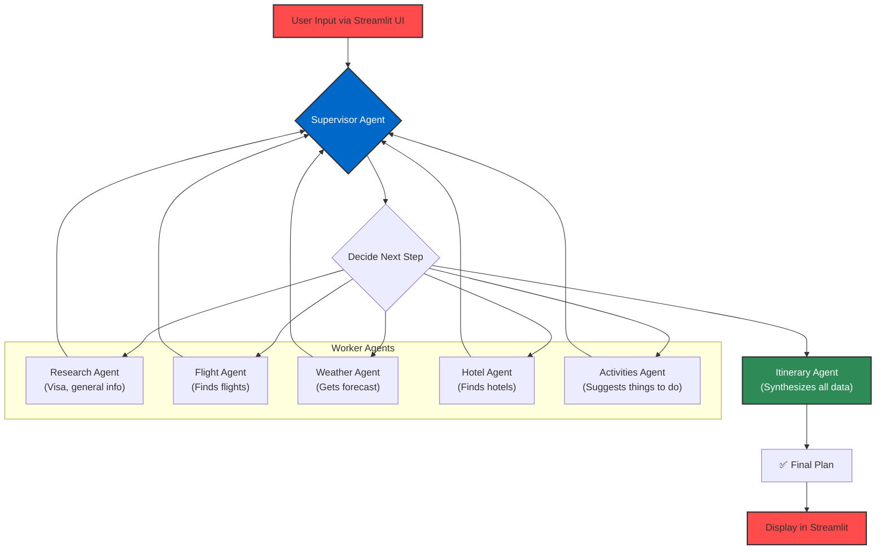

# ✈️ AI Trip Planner

Your personal AI travel agent that crafts detailed, personalized trip itineraries. Powered by a multi-agent system orchestrated with **LangGraph**, leveraging **Google's Gemini** for reasoning and **SerpApi** for real-time data.


[](https://YOUR_STREAMLIT_APP_URL_HERE) 
*<-- IMPORTANT: Replace the URL above with your actual Streamlit Cloud app link!*

---

## 🌟 Demo

This application provides a seamless experience for travel planning. Simply input your destination, dates, and preferences, and let the AI agents collaborate to build your perfect trip from scratch.


*<-- HIGHLY RECOMMENDED: Record a GIF of your app and replace the placeholder URL above!*

---

## ✨ Features

-   **📝 Dynamic Itinerary Generation:** Get a full day-by-day plan, including activities and meal suggestions.
-   **🌐 Real-time Data Integration:** Fetches up-to-date information for:
    -   **Visa Requirements:** Checks entry requirements for your destination.
    -   **Weather Forecasts:** Provides a detailed weather outlook for your travel dates.
    -   **Flight Options:** Finds real flight details, including prices and layovers.
    -   **Hotel Recommendations:** Suggests hotels with ratings and prices across different budgets.
-   **🤖 Multi-Agent Architecture:** Utilizes a team of specialized AI agents that work together, each handling a specific task (research, flights, hotels, etc.).
-   **💬 Interactive UI:** A simple and beautiful user interface built with Streamlit.

---

## 🛠️ How It Works: The Multi-Agent Architecture

This project is built on the concept of **agentic AI**, where different AI agents collaborate to solve a complex problem. The entire workflow is managed by **LangGraph**, creating a robust and stateful execution graph.

The core of the application is a graph where each node is a specialized agent (a "worker") and a `supervisor` agent orchestrates the flow.



1.  **User Input**: The user provides trip details through the Streamlit interface.
2.  **Supervisor Agent**: This is the "team lead." It maintains the current state of the plan and decides which agent to call next.
3.  **Specialist Agents**: Each worker agent has a specific tool and responsibility (e.g., finding flights, checking the weather).
4.  **Stateful Execution**: After each agent completes its task, it updates the shared state, and control returns to the supervisor.
5.  **Itinerary Agent**: Once all necessary information is collected, this final agent reviews all the data and writes a cohesive, day-by-day itinerary.
6.  **Final Output**: The formatted itinerary is passed back to the Streamlit UI for the user to see.

---

## 🚀 Tech Stack

-   **Orchestration**: `LangGraph` for building stateful, multi-agent applications.
-   **LLM**: `Google Gemini Pro` for reasoning, planning, and content generation.
-   **Tools & APIs**: `SerpApi` for integrating Google Search, Flights, and Hotels APIs.
-   **Frontend**: `Streamlit` for creating the interactive web application.
-   **Deployment**: `Streamlit Cloud` for easy hosting and sharing.

---

## 🚀 Local Setup and Installation

### 1. Clone the Repository
```bash
git clone https://github.com/your-username/your-repo-name.git
cd your-repo-name
```

### 2. Create a Virtual Environment
It's highly recommended to use a virtual environment to manage dependencies.
```bash
python -m venv venv
source venv/bin/activate  # On Windows, use `venv\Scripts\activate`
```

### 3. Install Dependencies
Create a `requirements.txt` file with the necessary libraries:
```txt
streamlit
langgraph
langchain
langchain-core
langchain-google-genai
google-search-results
python-dotenv
```

Then install them:
```bash
pip install -r requirements.txt```

### 4. Set Up Environment Variables
You will need API keys for Google Gemini and SerpApi. Create a file named `.env` in the root of your project and add your keys:
```env
# .env file
GEMINI_API_KEY="YOUR_GOOGLE_GEMINI_API_KEY"
SERPAPI_API_KEY="YOUR_SERPAPI_API_KEY"
```

### 5. Run the Application
```bash
streamlit run app.py
```
The application should now be running locally in your browser!

---

## ☁️ Deployment on Streamlit Cloud

1.  Push your code to a GitHub repository.
2.  Sign up or log in to [Streamlit Cloud](https://share.streamlit.io/).
3.  Click "**New app**" and connect your GitHub repository.
4.  Before deploying, go to the "**Advanced settings**".
5.  In the "**Secrets**" section, add your API keys. This is the secure way to handle them in the cloud.
    ```toml
    # Streamlit Cloud Secrets (secrets.toml format)
    GEMINI_API_KEY="YOUR_GOOGLE_GEMINI_API_KEY"
    SERPAPI_API_KEY="YOUR_SERPAPI_API_KEY"
    ```
6.  Click "**Deploy!**" and your app will be live.

---

## 🔮 Future Improvements

-   [ ] **User Authentication**: Allow users to save and view their past trip itineraries.
-   [ ] **Budgeting Tools**: Add a feature to track estimated costs for the trip.
-   [ ] **Interactive Map**: Visualize the itinerary on a map with pins for hotels and activities.
-   [ ] **More Tools**: Integrate agents for booking rental cars or finding local restaurants.

---

## 📜 License

This project is licensed under the MIT License. See the `LICENSE` file for details.
